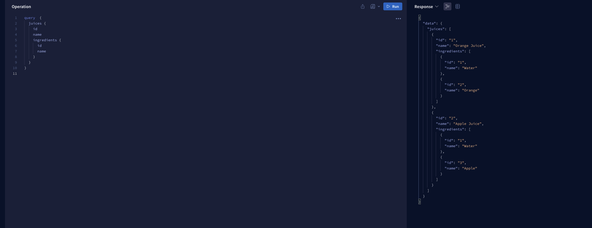

# Welcome to Juice Factory!

This is a simple supergraph, using Hive, Apollo Router and Apollo Composition Service.
The 2 available subgraphs are written in Go, using gqlgen

# What do I need
- Docker
- Hive running locally
- Apollo Router running locally

## How do I run it

- Follow the [Getting Started Guide for Hive](https://the-guild.dev/graphql/hive/docs/self-hosting/get-started) (please remember to enable external composition)
- Start up the docker-compose for Apollo (This will run only the composition service)
- Install the [Hive CLI](https://the-guild.dev/graphql/hive/docs/api-reference/cli) (I personally use the binary)
- Publish the schemas with the following command:
``hive schema:publish \
  --service="juice" \
  --url="http://127.0.0.1:3009/graphql" \
  --author "Juiceppe" \
  --commit "Initial Juices Subgraph" \
  subgraphs/juice-subgraph/graph/schema.graphqls``
  
	 ``hive schema:publish \
	  --service="ingredients" \
	  --url="http://127.0.0.1:3007/graphql" \
	  --author "Me" \
	  --commit "Initial Ingredients Subgraph" \
	  subgraphs/ingredients-subgraph/graph/schema.graphqls`` 
	  To publish the schemas you can either pass the endpoint and access token via the command or use a hive.json file (look at the ``hive.json.example`` in the root)
- Run  [Apollo Router](https://the-guild.dev/graphql/hive/docs/integrations/apollo-router) 
- Play around with the supergraph on localhost:4000 :)

## What's next?
- Add real data fetching from a local db
- Play around and wrap a rest API
- Manage to run Apollo Router with Docker (please help)

